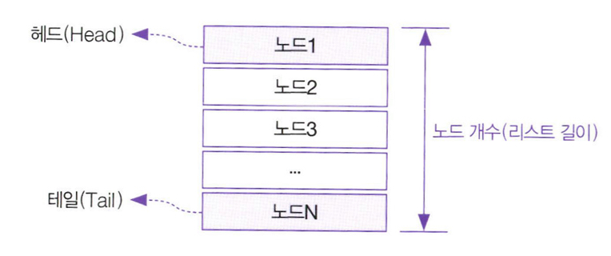

# `리스트`(List)
리스트는 목록 형태로 이뤄진 데이터 형식이다.

**노드**(Node, 마디): 리스트의 목록을 이루는 개별 요소

**헤드**(Head, 머리): 첫 번째 노드

**테일**(Tail, 꼬리): 마지막 노드

**리스트의 길이**: 헤드부터 테일까지 이르는 노드 개수

---

## 리스트 ADT
> ADT: 자료구조가 갖춰야 할 일련의 연산
- 리스트에 노드를 추가하는 연산(Append)
- 노드 사이에 노드를 삽입하는 연산(Insert)
- 노드를 제거하는 연산(Remove)
- 특정 위치에 있는 노드를 반환하는 연산(GetAt)

---

## 리스트 VS 배열
- 배열은 생성하는 시점에서 반드시 크기를 지정해줘야하고 그 크기를 변경할 수 없는 단점을 가짐
    > 너무 작게 선언하면 일을 제대로 할 수 없고 무작정 크게 선언하자니 메모리 부족 사태가 벌어짐. 그래서 리스트를 사용함
- 리스트와 배열은 데이터 집합 보관 기능을 가진다.
- 리스트는 배열과 다르게 유연하게 크기를 바꿀 수 있는 자료구조이다.